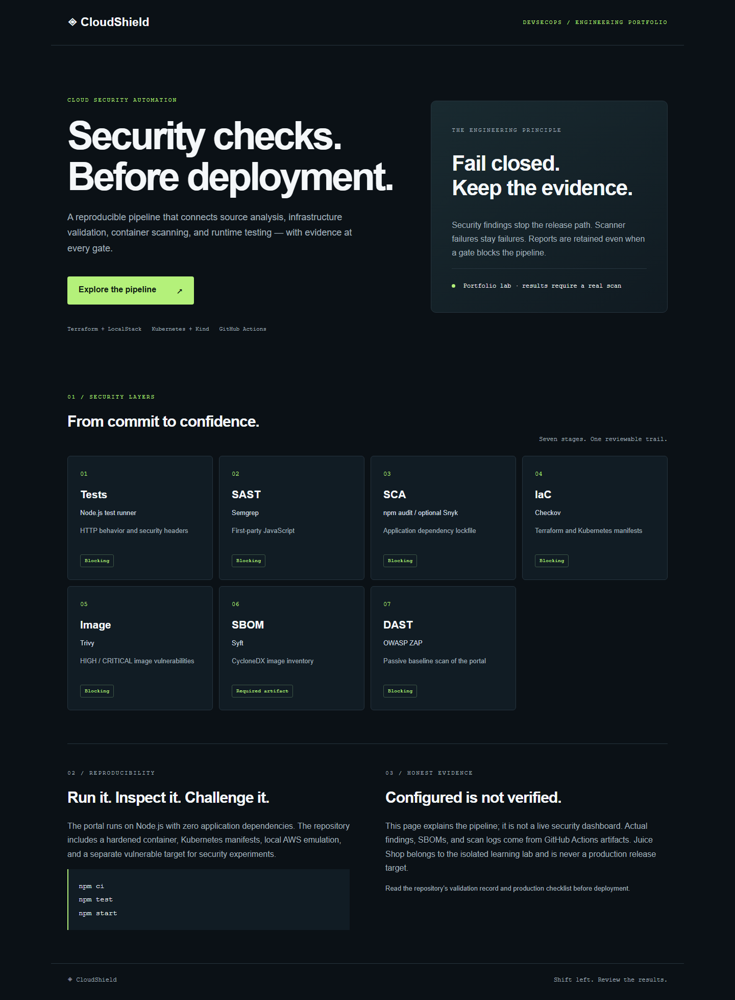
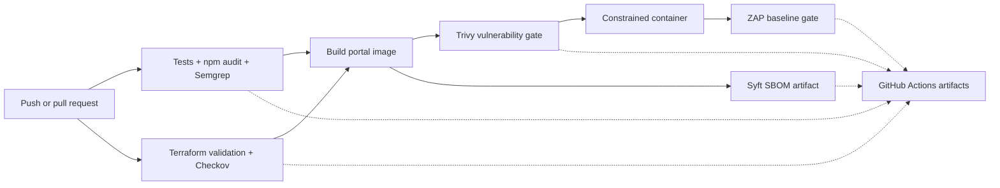

# CloudShield

**Cloud security automation with DevSecOps — a runnable engineering portfolio.**

CloudShield puts security checks before deployment and preserves the evidence when a check fails. It combines source analysis, dependency auditing, infrastructure policies, container scanning, an SBOM, and runtime testing. A small first-party web portal explains the architecture; OWASP Juice Shop is a separate, intentionally vulnerable lab target.



**Status:** application implemented and locally tested. Infrastructure and scanner workflows are configured; see [the validation record](docs/validation.md) for what has actually run. This is a local DevSecOps lab, with a [production promotion checklist](docs/production-readiness.md).

## Run in two minutes

Install Node.js 24, then:

```sh
npm ci --ignore-scripts
npm test
npm start
```

Open **http://127.0.0.1:3000**. The application has zero third-party runtime dependencies. On Windows, use `npm.cmd` if PowerShell blocks `npm.ps1`.

`npm run demo` starts a temporary server, checks its endpoints, prints the pipeline stages, and exits. It does not run scanners.

With Docker:

```sh
docker compose up --build -d portal
docker compose logs portal
docker compose stop portal
```

## What this demonstrates

| Engineering concern | Implementation | Reviewable evidence |
| --- | --- | --- |
| Secure HTTP behavior | Allowlisted static routes, restrictive CSP, no dynamic HTML, safe method handling | HTTP integration tests |
| Shift-left code security | Custom Semgrep rules with vulnerable test fixtures | JSON findings and rule-test logs |
| Dependencies | Locked application manifest, blocking npm audit, optional Snyk workflow | Audit JSON |
| Infrastructure | Terraform private subnet and Kubernetes hardening policy | Checkov JSON, Terraform validation logs |
| Image security | Non-root image, constrained runtime, blocking Trivy HIGH/CRITICAL scan | Image ID and Trivy JSON |
| Supply-chain inventory | Syft scans the exact saved image | CycloneDX JSON SBOM |
| Runtime checks | ZAP passive baseline against the scanned portal image | HTML and JSON reports |
| Local cloud practice | LocalStack AWS network emulation plus Kind deployment | Reproducible lab commands |

The repository has not reconstructed the report's original screenshots, historical runs, or quantitative results. New evidence must come from new executions.

## Pipeline



The main workflow uses GitHub-hosted runners and requires no AWS or Snyk credentials. Source and infrastructure checks run independently. The image job requires both to pass. ZAP tests the same local image scanned by Trivy; this workflow does not automatically publish or deploy a release. Failed scans retain reports through `if: always()` artifact uploads.

Strict DAST may block on warnings. Review the report and fix the cause; any accepted exception must be documented before changing the policy. Scanner failures are never converted into clean scan results.

GitHub Actions are pinned to full commit hashes. Scanner container tags are version-pinned but remain mutable; immutable digests and verified provenance are required before production promotion. See [security policy](docs/security-policy.md).

## Local infrastructure lab

Use Linux or WSL2 with Docker, Compose v2, Terraform >=1.9, Kind, kubectl, and curl. Docker Desktop's license and GitHub plan limits may apply; local execution is not a guarantee of zero total cost.

```sh
bash scripts/lab-up.sh
kubectl --context kind-cloudshield -n cloudshield port-forward svc/portal 3000:3000
```

The script creates a cluster named `cloudshield` and a VPC/subnet **inside LocalStack**, using dummy credentials and a loopback endpoint. The emulated VPC does not wrap, secure, or connect to the Kind cluster. These are independent demonstrations of AWS IaC and Kubernetes deployment.

For the optional vulnerable target:

```sh
kubectl --context kind-cloudshield apply -f lab/juice-shop.yaml
kubectl --context kind-cloudshield -n cloudshield-target rollout status deployment/juice-shop --timeout=180s
bash scripts/zap-lab.sh
```

The lab scanner connects only to loopback port 3001. Its audit mode accepts ZAP findings (exit 1/2), retains the report, and rejects execution errors. It is separate from the portal's blocking pipeline.

When finished, `bash scripts/lab-down.sh` destroys the emulated Terraform resources, removes only the named Kind cluster, and stops LocalStack. Keep LocalStack running until Terraform destruction finishes.

## Repository map

```text
src/                 First-party HTTP server
public/              Responsive architecture portal
test/                HTTP and security-header integration tests
security/            Semgrep rules, fixtures, explicit Checkov policy
infra/local/         LocalStack-only Terraform network
k8s/                 Hardened local portal deployment
lab/                 Isolated vulnerable Juice Shop target
scripts/             Smoke demo, lab setup/teardown, lab DAST
.github/workflows/   Blocking security workflow and optional Snyk audit
docs/                Architecture, policy, validation, operational handoff
```

## Recruiter walkthrough

Start with [the five-minute walkthrough](docs/recruiter-walkthrough.md), then inspect the tests and workflow dependency graph. In an interview, demonstrate a Semgrep fixture being detected, show a real Actions artifact, and explain why findings in the vulnerable lab differ from release-blocking findings.

## Attribution

The supplied academic report, *CloudShield: Cloud Security Automation with DevSecOps*, names **Aydi Oumayma** as its author. It informs the architectural scope of this new implementation. That report's authorship, host-organization work, historical achievements, and measurements are not asserted as achievements of this repository's maintainer. The PDF itself is not redistributed here. OWASP Juice Shop is third-party software, maintained by its own contributors.

Implementation assistance and verified results are described in [the validation record](docs/validation.md). Describe your own contributions accurately when using this project in applications.

## References

- [ZAP baseline scan and exit codes](https://www.zaproxy.org/docs/docker/baseline-scan/)
- [LocalStack Terraform integration](https://docs.localstack.cloud/aws/connecting/infrastructure-as-code/terraform/)
- [Kind documentation](https://kind.sigs.k8s.io/docs/user/quick-start/)
- [Trivy release used by the workflow](https://github.com/aquasecurity/trivy/releases/tag/v0.75.0)
- [Semgrep release used by the workflow](https://github.com/semgrep/semgrep/releases/tag/v1.179.0)
